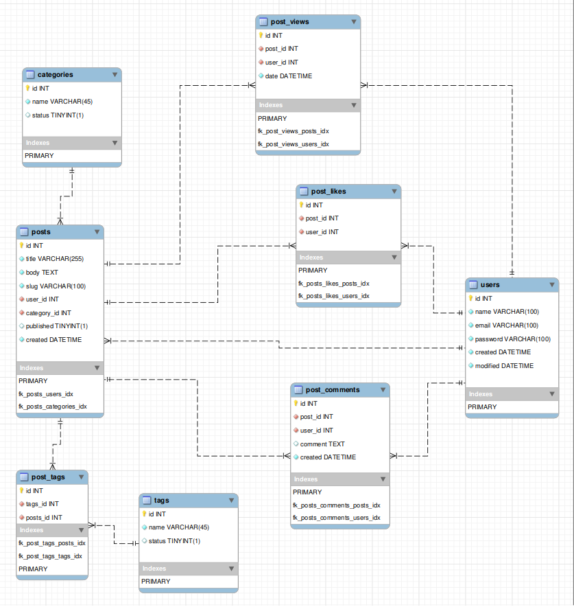

## MVP Blog API using CakePHP 4

### Setup:


##### 1. Copy the .env.example file to .env:
```
cp .env.example .env
```
##### 2. Install dependencies and set up the project:
```
make setup
```


### Running Tests:

##### To run all tests:
```
make test
```


### API Routes:


##### Add new TAG
```
curl --location 'http://0.0.0.0:8180/api/tags' \
--header 'Content-Type: application/json' \
--data '{
    "name": "New Tag",
    "status": 1
}'
```

##### Add new Category
```
curl --location 'http://0.0.0.0:8180/api/categories' \
--header 'Content-Type: application/json' \
--data '{
    "name": "New Category",
    "status": 1
}'
```

##### Add new User
```
curl --location 'http://0.0.0.0:8180/api/users' \
--header 'Content-Type: application/json' \
--data-raw '{
    "name": "Danilo Pereira",
    "email": "danilo@email.com",
    "password": "password123"
}'
```


##### Add new Post
```
curl --location 'http://0.0.0.0:8180/api/posts' \
--header 'Content-Type: application/json' \
--data '{
"title": "New Post",
"body": "This is the content of the post.",
"slug": "new-post-title",
"user_id": 1,
"category_id": 1,
"published": 0
}'
```

##### List Posts (with category filter)
```
curl --location 'http://0.0.0.0:8180/api/posts?category_id=1' \
--data ''
```


### Entity-Relationship Diagram:


### Postman collection (with the endpoints):
[download it here!](docs/postman.collection.json)
